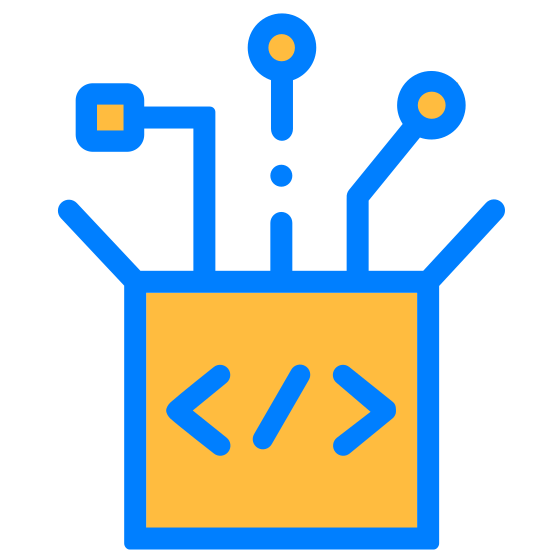

# GameForge para Godot

[English Version](README.md)

`ss-gameforge-godot` es el toolkit reutilizable de Slice Soft para
**Godot Engine 4.x**. Reúne bloques prácticos de gameplay y arquitectura para
acelerar proyectos sin imponer una estructura rígida.

[](https://github.com/slice-soft/ss-gameforge-godot/releases)


[](https://github.com/sponsors/slice-soft)

## Filosofía

GameForge sigue una línea simple:

- **Opt-in sobre lock-in**: usa solo los módulos que tu juego necesita
- **Legible sobre mágico**: el código debe poder inspeccionarse y extenderse con facilidad
- **Reutilizable sobre desechable**: la base debe servir en varios proyectos Godot
- **Práctico sobre ceremonial**: resolver problemas comunes con APIs pequeñas y directas

## Addons

- `ss-gameforge-dialogue`
- `ss-gameforge-singleton`
- `ss-gameforge-state-machine`
- `ss-gameforge-toast`
- `ss-gameforge-wired`

## Módulos incluidos

### SingletonNode
Acceso seguro a singletons tipo servicio.

```gdscript
SaveService.i.save_game()
BossFightDirector.i.next_phase()
```

### State Machine
Utilidades FSM orientadas a gameplay para personajes, enemigos, UI y flujos.
Los estados son nodos hijos, y la máquina solo reenvía los callbacks que cada uno define.

```gdscript
state_machine.change_to("Running")
```

### Toast UI
Helpers de feedback visual con cola, animaciones y soporte de temas.

```gdscript
ToastService.i.info("Guardado")
ToastService.i.success("Nivel completado")
ToastService.i.danger("Error al cargar")
```

### Dialogue Manager
Orquestación de diálogos desacoplada de la presentación. Las líneas viven en un
`DialogueResource`, así que escribir contenido nunca implica tocar la vista.

```gdscript
dialogue_view.play(resource)
```

> Etapa temprana: las líneas se reproducen en secuencia, con efecto máquina de
> escribir y soporte de BBCode. Las ramificaciones y opciones todavía no están.

### Wired
Entrada basada en acciones: el gameplay pide `"jump"`, nunca `KEY_SPACE`. Soporta
bindings por jugador, remapeo en runtime, cooperativo local y gamepads en caliente.

```gdscript
if GWInputManager.i.is_action_just_pressed("jump"):
	saltar()
```

## Módulos planeados

Todavía no se entregan. Están listados para que la dirección sea visible — no
programes contra esto.

### EventBus
Comunicación desacoplada entre sistemas sin referencias fuertes.

```gdscript
EventBus.on(self, {
  "player_died": "_on_player_died",
  "health_changed": "_on_health_changed",
})

EventBus.emit("player_died", player_id)
```

## Documentación

Cada addon tiene su página de referencia en ambos idiomas:

| Addon | Español | English |
|---|---|---|
| `ss-gameforge-singleton` | [SingletonNode](docs/es/singleton-node.md) | [SingletonNode](docs/en/singleton-node.md) |
| `ss-gameforge-toast` | [Toast](docs/es/toast.md) | [Toast](docs/en/toast.md) |
| `ss-gameforge-dialogue` | [Dialogue](docs/es/dialogue.md) | [Dialogue](docs/en/dialogue.md) |
| `ss-gameforge-state-machine` | [State Machine](docs/es/state-machine.md) | [State Machine](docs/en/state-machine.md) |
| `ss-gameforge-wired` | [Wired](docs/es/wired.md) | [Wired](docs/en/wired.md) |

## Primeros pasos

1. Copia el addon de este repositorio dentro de `res://addons/` en tu proyecto Godot.
2. Activa el plugin desde `Project Settings -> Plugins`.
3. Instala los autoloads requeridos desde el panel del plugin si el módulo lo necesita.

> Cada módulo es su propio directorio de addon — `addons/ss-gameforge-toast/`,
> `addons/ss-gameforge-wired/`, y así. Copia solo los que necesites, más
> `ss-gameforge-singleton`: Toast y Wired extienden `SingletonNode`.

## Roadmap

- [ ] Wizard de autoloads
- [ ] Generadores de escenas y features
- [ ] Importadores de diálogos (JSON / CSV)
- [ ] Documentación ampliada por módulo
- [ ] Escenas demo

## Flujo de release

- Los features llegan a `release` mediante squash merge.
- Los pushes a `release` crean prereleases como `ss-gameforge-toast-v1.2.0-rc.1`.
- Después de QA, abre el PR de promoción de `release` a `main` y mergéalo con **rebase**,
  que conserva un commit por feature en `main`.
- El release estable solo se genera cuando ese promote se mergea en `main`.
- El listado de addons del README, la landing y la documentación se actualizan manualmente desde releases estables en `main`.

## Contribuir

Consulta [CONTRIBUTING.md](./CONTRIBUTING.md) para setup y reglas específicas
de este repositorio. El flujo general, las convenciones de commit y las normas
de comunidad viven en
[ss-community](https://github.com/slice-soft/ss-community/blob/main/CONTRIBUTING.md).

## Comunidad

| Documento | |
|---|---|
| [CONTRIBUTING.md](https://github.com/slice-soft/ss-community/blob/main/CONTRIBUTING.md) | Flujo de trabajo, commits y PRs |
| [GOVERNANCE.md](https://github.com/slice-soft/ss-community/blob/main/GOVERNANCE.md) | Toma de decisiones y roles |
| [CODE_OF_CONDUCT.md](https://github.com/slice-soft/ss-community/blob/main/CODE_OF_CONDUCT.md) | Estándares de comunidad |
| [VERSIONING.md](https://github.com/slice-soft/ss-community/blob/main/VERSIONING.md) | Política SemVer y breaking changes |
| [SECURITY.md](https://github.com/slice-soft/ss-community/blob/main/SECURITY.md) | Reporte de vulnerabilidades |
| [MAINTAINERS.md](https://github.com/slice-soft/ss-community/blob/main/MAINTAINERS.md) | Maintainers activos |

## Licencia

MIT. Consulta [LICENSE](./LICENSE).
